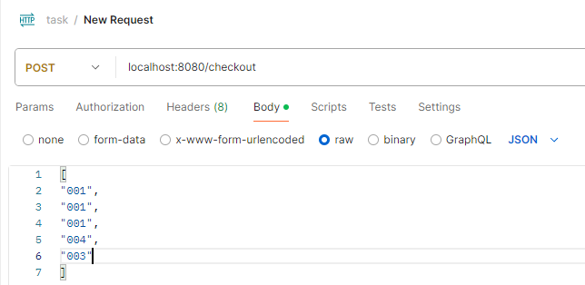

# Watch Catalogue Spring Boot Project

## Description
This is a newly created Spring Boot project which consists of one endpoint, /checkout to calculate total price of the cart based on the given input

### Prerequisites
- JDK 17 or higher
- Maven 3.6+
- PostgresSQL database (optional, for local development)
- Git
- Postman for testing the endpoint
## Getting Started
1. Clone the repository
```bash
git clone git@github.com:sarvesh-matam/task.git
cd task
```
2. Database configuration
```bash
- PostgreSQL: Install PostgreSQL and create a database named "postgres" and "test"
- Create schema named "task" both of the databases
- Update src/main/resources/application.yaml & application-test.yaml with your database credentials
```

3. Build and Run
```bash
Build the application using Maven and run it:
mvn clean package
java -jar target/watch-catalogue-0.0.1-SNAPSHOT.jar
```
The application will start on http://localhost:8080.

4. Test the application



## API Documentation
todo - Need to implement open API Specification

## Approach
### Architecture
The application follows a typical three-layer architecture:

- Controller Layer: Handles incoming HTTP requests and delegates to the service layer.
- Service Layer: Contains business logic and interacts with the repository layer.
- Repository Layer: Interfaces with the database using Spring Data JPA.

### Features Implemented
- Post endpoint to calculate total price of the cart during checkout
- Validation : Input validation for watch id data using jakarta validator

### Areas for Improvement

While developing this application, some areas for improvement and future considerations include:
- Security: Implement authentication and authorization using Spring Security.
- Testing: Increase test coverage with unit tests for services and controllers
- Performance: Retrieve the static data from database and store in corresponding collection objects for example list, set, map etc.. while application startup to minimize database calls
- Logging: Enhance logging to facilitate troubleshooting and monitoring.
- Database change : Implement Liquibase for  database schema change management to track database changes